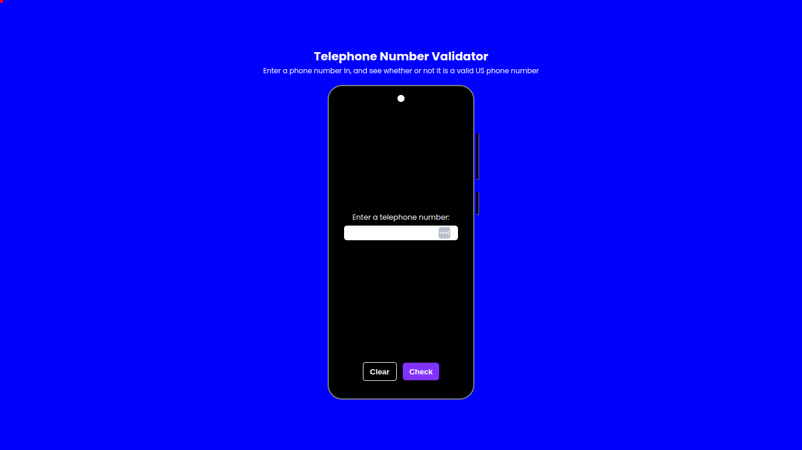

# Telephone Number Validator

[-red)](https://www.freecodecamp.org/learn/javascript-algorithms-and-data-structures-v8/)

A simple tool to validate whether or not a phone number is a US phone number or not. Feel free to check the <a href="https://telephone-number-validator-liart.vercel.app/" target="_blank">website</a> out, and give feedback on what I can improve if you like.

## Technologies:
1. HTML
2. CSS
3. JavaScript

## Project Motive:
This is a certification project (meaning, I have to build it on my own) for <a href="https://www.freecodecamp.org/learn/javascript-algorithms-and-data-structures-v8/" target="_blank">freeCodeCamp JavaScript Algorithms and Data Structures (Beta) Course</a>.

## Contributions:
If you really like the integer to Telephone Number Validator, and you see something you can improve, feel free to **fork** this repo, make your changes, and submit a pull request. If you see any spelling mistake on this markdown file, or on the website, please make an **issue**, so that I can fix it. Thanks. Recommendations on how I can improve it would be great.

## What I learnt from making this project:
1. HTML
2. CSS
3. JavaScript
4. Mobile Responsiveness
5. Basic Data Structures And Algorithms
6. Problem Solving Skills

## License:
This project is under the MIT license. Feel free to do whatever you want with it, I really don't care.

## Conclusion:
If you are someone that are looking to hire a developer, whether it is freelancing work, an internship, or a full time position, feel free to reach out to me with one of the following channels: 

<ul>
  <li>
    <a target="_blank" href="mailto:business@williamferns.com">Email: business@williamferns.com</a>
  </li>
  <li>
    <a target="_blank" href="https://twitter.com/willfernsdev">Twitter: willfernsdev</a>  
  </li>
  <li>
    <a target="_blank" href="https://www.linkedin.com/in/william-ferns-12670a2b6/">Linkedin</a>
  <li>
    
Discord: williamferns

  </li>
</ul>

---
